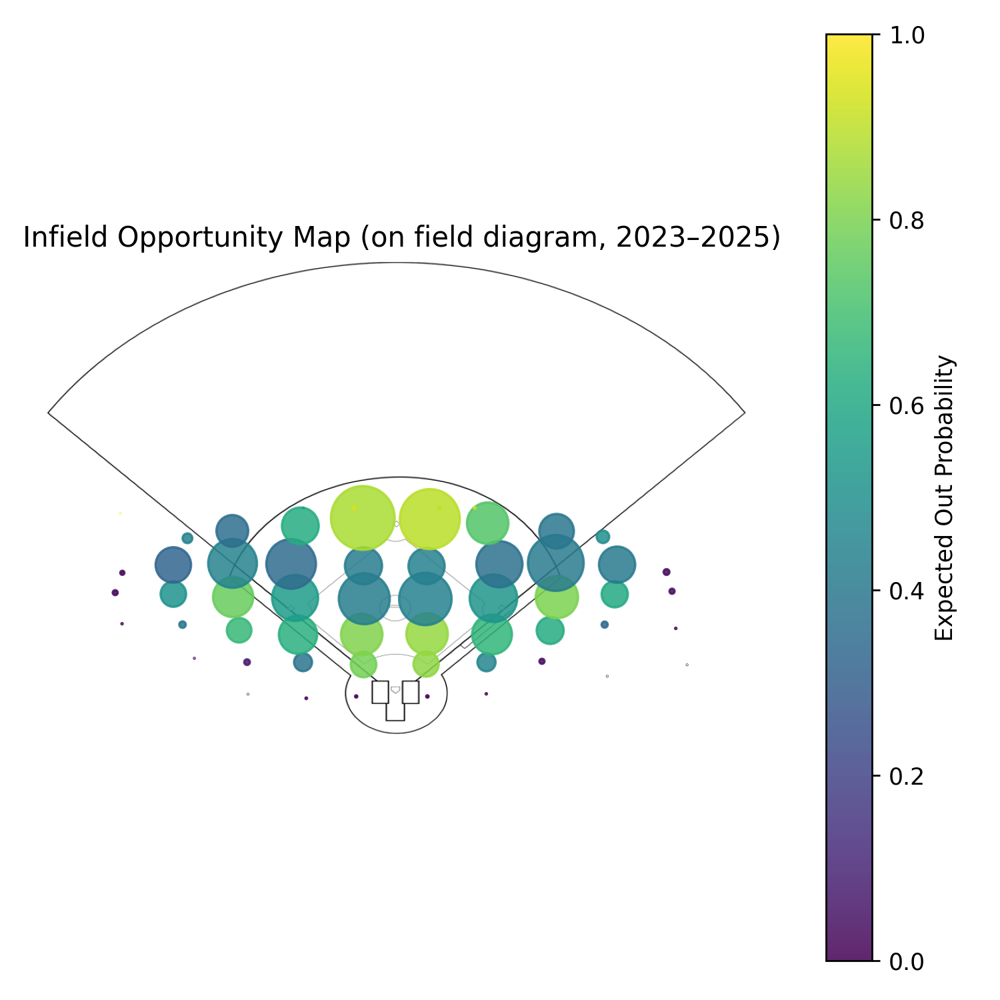

# Infield Defensive Range and Opportunity Analysis



**TL;DR**  
This project uses MLB Statcast data (2023–2025) to model **league-average infield defensive opportunity** based on batted-ball location, then evaluates team performance using **Outs Above Average (OAA)**.  
By separating *where the ball was hit* from *what the defense did*, the analysis provides a clearer view of infield defensive value independent of opportunity difficulty.


## Project Overview
This project quantifies **infield defensive opportunity and performance** using MLB Statcast batted-ball data from the 2023–2025 seasons.  
The goal is to separate *opportunity* from *execution* by estimating how likely a given ball in play is to be converted into an out based on where it is hit, then measuring how teams perform relative to that expectation.

Rather than starting with results, the analysis first builds a **league-average spatial model of infield outs**, then applies that model to compute **Outs Above Average (OAA)** at the team level.

---

## League-Average Infield Opportunity Map


This visualization shows **league-average expected out probability** for infield balls in play from the 2023–2025 MLB seasons. Each point represents a spatial zone on the infield, with:

- **Color** indicating expected probability of recording an out  
- **Bubble size** representing the number of balls hit to that zone  
- **Position** derived from Statcast `hc_x` / `hc_y` spray coordinates  

To improve interpretability for baseball audiences, Statcast coordinates are mapped onto a regulation infield diagram using an affine transformation calibrated to home plate and the three bases. This allows defensive opportunity to be evaluated in familiar on-field context while preserving the underlying spatial relationships in the data.

---

## Key Questions
- Where on the infield are outs most and least likely to be recorded?
- How do teams differ once opportunity difficulty is accounted for?
- Which teams consistently convert harder infield chances into outs?

---

## Method Summary
- **Data**: MLB Statcast (via `pybaseball`), seasons 2023–2025  
- **Inclusion**: Balls in play with recorded spray coordinates (`hc_x`, `hc_y`)  
- **Infield definition**: Coordinate-based proxy (`hc_y ≤ 150`)  
- **Opportunity model**: League out rate by spatial zone (10 × 6 grid)  
- **Difficulty buckets**: Percentile-based quintiles (balanced across league)  

**Metrics**
- Expected outs = zone-level out probability  
- OAA = Actual outs − Expected outs  
- OAA per 100 = rate-scaled version for comparability  

---

## Core Outputs
- **League Average Opportunity Map**  
  `figures/infield_opportunity_map_on_field.png`

- **Team Infield OAA Leaderboards**  
  - `figures/team_infield_oaa_per100_2023.png`  
  - `figures/team_infield_oaa_per100_2024.png`  
  - `figures/team_infield_oaa_per100_2025.png`

---

## How to Run This Project

### Prerequisites
- **Python**: 3.12.x  
- **Operating System**: Windows, macOS, or Linux  
- **Disk space**: ~2–3 GB free (Statcast data + SQLite DB)

### 1. Clone the repository
```bash
git clone <your-repo-url>
cd infield-defense

```

### 2. Create and activate a virtual environment
```bash
py -3.12 -m venv .venv
```
Windows:
```bash
.venv\Scripts\activate
```


### 3. Install dependencies
```bash
pip install -r requirements.txt

```

### 4. Pull Statcast data (2023–2025)
```bash
py -3.12 src/pull_statcast_raw.py

```

### 5. Build SQLite database and derived tables
```bash
py -3.12 src/build_sqlite_db.py

```

### 6. Generate figures
```bash
py -3.12 src/make_opportunity_map.py

```

---

